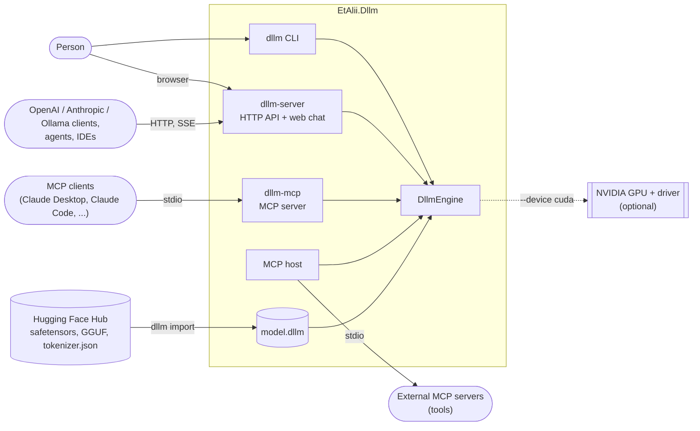

# Architecture

This is the entry point to the architecture documentation of EtAlii.Dllm: how the pieces fit together, drawn as
[Mermaid](https://mermaid.js.org/) diagrams that GitHub renders inline. The reference documents
([kernels](../kernels.md), [model format](../model-format.md), [HTTP API](../api.md), [MCP](../mcp.md),
[training](../training.md), [releasing](../releasing.md)) hold the exact formulas, byte layouts and wire formats;
these pages explain the structure around them and link there for detail.

| Document | What it covers | Status |
| --- | --- | --- |
| Overview (this page) | System context, layers, module map, the one rule every layer follows | ✅ |
| [Determinism by design](determinism.md) | Every source of nondeterminism and the layer that removes it | ✅ |
| [Inference pipeline](inference.md) | One chat request from messages to token stream, KV and prompt caches, batching | ✅ |
| [Kernels and compute backends](kernels.md) | The C++ layer, SIMD and thread dispatch, CUDA, the build | ✅ |
| [Model import and format](models.md) | From safetensors/GGUF to `model.dllm` to a running decoder | ✅ |
| [Front ends, APIs and MCP](front-ends.md) | How the CLI, the OpenAI, Anthropic and Ollama APIs and MCP share one engine | ✅ |
| [Fine-tuning](training.md) | One reproducible training step, checkpoints and resume | ✅ |
| [Build, CI and releases](delivery.md) | Workflows, wheels, the Docker image | ✅ |

## The one rule

Everything below serves a single requirement: on the same hardware, the same weights, prompt, context window and
sampling options give the same output bits on every run, whatever the load, batching or thread scheduling, and on
every supported machine. That rule decides where code lives:

- Anything that reduces floating point numbers (sums, dot products, matmul, softmax, norms, attention) is a C++
  kernel with one documented order, never NumPy, BLAS or a GPU library.
- Randomness comes from one seeded generator (`DeterministicRandom`), never from the clock or the operating system.
- The front ends contain no logic of their own, so a question asked through the CLI, the OpenAI API, the Anthropic
  API or MCP gets the same answer.

## System context

Who and what talks to the engine. Everything inside the box is this repository.

- **Front ends:** `dllm` (generate, chat, import, finetune), `dllm-server` (OpenAI Chat Completions and Responses,
  Anthropic and Ollama compatible HTTP APIs plus a chat page at `/`) and `dllm-mcp` (the model as an MCP server). The MCP host goes the other way: it lets
  the model call tools of external MCP servers during a chat.
- **Models** are not trained here from scratch. Small open-weight models are converted once by `dllm import` into
  a single `model.dllm` file that records weights, tokenizer, chat template, source and licence. Without a model file
  the engine runs a seeded placeholder (a bigram table) so every path can be tested without downloads.
- **The GPU** is optional and never changes the output: the CUDA kernels run the CPU kernels' exact order.

## Layers

Each layer only calls the one below it. The Python layers decide *what* to compute; every floating point reduction
happens in the C++ layer.

```mermaid
flowchart TB
    subgraph fe["Front ends (thin, no logic)"]
        direction LR
        cli["cli.py"]
        app["server/app.py, responses_api.py<br/>anthropic_api.py, ollama_api.py"]
        mcps["mcp_server.py"]
        mcph["mcp_host.py"]
    end

    subgraph eng["Engine facade"]
        engine["engine.py: DllmEngine.chat_stream"]
    end

    subgraph chat["Chat and decoding"]
        direction LR
        tmpl["chat.py, chat_template.py<br/>prompt rendering"]
        tools["tools.py, grammar.py<br/>tool calls, JSON-schema masks"]
        gen["generation.py<br/>autoregressive loop"]
        samp["sampling.py<br/>seeded sampler"]
        tok["bpe.py, tokenization.py<br/>tokenizers"]
    end

    subgraph model["Model"]
        direction LR
        tr["transformer.py<br/>decoder + KV cache"]
        arch["architecture.py<br/>TransformerConfig"]
        mf["modelfile.py<br/>model.dllm"]
    end

    subgraph num["Numerics (Python)"]
        direction LR
        numerics["numerics.py, tensor.py"]
        cuda["cuda.py<br/>CudaTensor"]
    end

    subgraph cpp["C++ extension etalii_dllm._kernels"]
        direction LR
        kern["math, nn, grad, quant, random"]
        disp["simd.hpp, parallel.hpp"]
        cu["cuda.hpp + cuda/kernels.cu<br/>(NVRTC at run time)"]
    end

    fe --> eng --> chat --> model --> num --> cpp
```

Three subsystems sit beside this stack rather than in it: `interpret/` runs the decoder with a `LayerHook` that
observes (or deliberately changes) its activations; `importing/` writes `model.dllm` files (it uses the file
format and the configuration, not the decoder), and `training/` reuses the decoder and adds gradient kernels and
AdamW from `grad.hpp`.

## Module map

### Python package `src/etalii_dllm/`

| Module | Responsibility |
| --- | --- |
| `engine.py` | `DllmEngine`, the facade every front end uses. `chat_stream` renders the prompt, sets up constrained decoding, runs the generator and turns its steps into events (`TextDelta`, `ToolCallEvent`, `Finished`); `chat_completion` collects the same events, so streamed and non-streamed answers are identical. Also embeddings and content-derived ids. |
| `chat.py` | Chat messages and the fixed prompt format for models without a chat template. |
| `chat_template.py` | Renders a model's own Jinja chat template the way `transformers` does. |
| `tools.py` | Tool calling in the Hermes `<tool_call>` format: presenting tools, constraining and parsing calls. |
| `grammar.py` | Constrained decoding: byte-level JSON and regex grammars and the token masks they induce over a token trie. |
| `batch_jobs.py` | `dllm batch`: OpenAI batch files run concurrently with output in input order and content-derived ids, exact resume, digests and `--verify`. |
| `regexp.py` | Regular expressions compiled to byte-level DFAs (UTF-8 ranges included) for regex-constrained output. |
| `generation.py` | The autoregressive loop: forward pass, sample, append, repeat; stop sequences, logprobs, result fingerprint. |
| `speculative.py` | Drafters for speculative decoding (prompt lookup, a draft model); the loop in `generation.py` keeps only drafted tokens it would have chosen. |
| `prompt_cache.py` | KV caches of earlier requests, lent to the next prompt that shares their prefix; saves work, never changes tokens. |
| `batching.py` | Continuous batching: concurrent generations share one `forward_batch` per step, each keeping its solo bits. |
| `sampling.py` | Logit bias, repetition/frequency/presence penalties, then temperature, top-k, top-p and min-p sampling with a seeded generator and ties broken on token id; choice seeds for `n`. |
| `tokenization.py`, `bpe.py` | The byte tokenizer of the placeholder model, and BPE (byte-level or SentencePiece-style) driven by a `tokenizer.json`. |
| `verify.py` | `dllm verify`: one fingerprint of a fixed workload (kernels, Unicode, tokenizer, logits, answers) to compare machines; `--reference` compares the model's answers with `reference.py`. |
| `reference.py` | A second, independent implementation of the [specification](../specification.md) (transcendentals, kernels, RNG, sampler, decoder) in Python and elementwise NumPy, sharing no code with the C++ kernels. |
| `conformance.py` | `dllm conformance write/check`: test vectors (inputs and exact outputs of every kernel, the sampler and two decoders) for any implementation. |
| `unicode.py` | Normalisation, lower-casing and regex categories from Unicode 15.1 tables shipped in the package, so the Python version cannot change tokenization. |
| `models.py` | The `LanguageModel` protocol and the seeded placeholder `BigramModel`. |
| `transformer.py` | The Llama/Qwen2/Qwen3 decoder (RMSNorm, QK-norm, RoPE, grouped-query attention, SwiGLU) and its KV cache, on CPU or GPU, float32, Q8_0 or Q4_0. |
| `lora.py` | LoRA adapters: merging `W + scale · B·A` with the `linear` kernel, adapter gradients, and the PEFT directory format. |
| `architecture.py` | `TransformerConfig`: the shape of a decoder, independent of where its weights came from. |
| `modelfile.py` | Reading and writing the `model.dllm` container ([format](../model-format.md)), its lineage and whole-file hash ([verifiable models](../provenance.md)). |
| `numerics.py`, `tensor.py` | Thin wrappers over the C++ kernels, fingerprints, `DeterministicRandom`, and the 64-byte aligned float32 `Tensor`. |
| `cuda.py` | The GPU backend: finding NVRTC, `CudaTensor`, device-side operations. |
| `importing/` | Readers for safetensors and GGUF (with GGML dequantisation), the Hugging Face download pinned to a commit, the licence policy, and `dllm import`. |
| `interpret/` | Interpretability tools on the decoder's own pass: activation tracing through `LayerHook` (observation cannot change a bit), the logit lens, the embedding explorer, attention maps and their HTML/SVG views (`dllm lens`, `attention`, `neighbours`), steering vectors (`steer`, `--steer`), ROME edits (`edit`) and sparse autoencoders (`sae`); [interpretability](../interpretability.md). |
| `evaluation.py` | `dllm eval`: log-likelihood scoring (perplexity and multiple choice, as lm-evaluation-harness does) with fixed-order sums and a fingerprint over every log-probability; [evaluation](../evaluation.md). |
| `receipts.py` | Generation receipts: the engine request and hashes of the output as content-addressed JSON, and `verify`, which replays a receipt (`dllm replay`, `POST /v1/receipts/verify`); [receipts](../receipts.md). |
| `transcripts.py`, `builtin_tools.py` | Agent transcripts and their offline replay; deterministic built-in tools ([reproducible agents](../agents.md)). |
| `signing.py` | Deterministic Ed25519 signatures on receipts, transcripts and model files (`dllm sign`, `--sign-key`, `--trust`); [verifiable models](../provenance.md#signatures). |
| `merging.py`, `exporting.py` | Exact model merges (`dllm merge`: linear, SLERP, TIES) and exports to Hugging Face safetensors and GGUF (`dllm export`); distillation lives in `training/distill.py` (`dllm distill`). [Building models](../model-building.md). |
| `serving.py` | Deterministic serving at scale: the exact response cache (`--response-cache`), coalescing of identical in-flight requests, the self-audit (`--audit-every`, `GET /v1/audit`) and `dllm audit`; [serving at scale](../serving.md). |
| `retrieval.py` | Exact document retrieval: fixed chunking, the `dllm index` file (vectors plus chunks in safetensors), cosine, BM25 (pinned-Unicode terms) and hybrid (reciprocal rank fusion) search with a total order, and the `Retriever` that grounds chats (`--index`, `--index-mode`); [retrieval](../retrieval.md). |
| `reranking.py` | A chat model as a relevance judge, `sigmoid(logit(yes) - logit(no))` after a fixed prompt (`dllm rerank`, `/v1/rerank`, `--rerank-model`); [reranking](../retrieval.md#reranking). |
| `watermark.py` | Keyed green-list watermarks with integer-only green lists: the sampler's bias (`--watermark-key`, `watermark`) and exact detection (`dllm watermark detect`, `/v1/watermark/detect`); [watermarks](../watermarks.md). |
| `training/` | Gradients of the decoder, AdamW, fixed data order and checkpoints that resume bit for bit (`dllm finetune`), for all parameters or LoRA adapters; training receipts that replay a run (`training/receipt.py`). |
| `server/` | The OpenAI Chat Completions (`app.py`, `contracts.py`), OpenAI Responses (`responses_api.py`), Anthropic (`anthropic_api.py`, `anthropic_contracts.py`) and Ollama (`ollama_api.py`) wire formats, and the chat page `static/chat.html`. |
| `mcp_server.py` | The model as an MCP server over stdio (tools, prompts, resources). |
| `mcp_host.py` | The MCP client host: the model calls external MCP tools in a loop over `chat_stream`. |
| `cli.py` | The `dllm` command. |

### C++ kernels `cpp/`

| File | Responsibility |
| --- | --- |
| `include/dllm/random.hpp` | xoshiro256\*\* seeded by SplitMix64, the one source of random numbers. |
| `include/dllm/math.hpp` | Fixed-order reductions and `exp`, `log`, `sin`, `cos`, `tanh`, `erf` built from `+ - * /` and `sqrt`. |
| `include/dllm/nn.hpp` | Matmul, RMSNorm, activations, RoPE and attention; every output element has its own accumulation in one order. |
| `include/dllm/grad.hpp` | Backward kernels, cross-entropy and the AdamW update, with the same ordering rules. |
| `include/dllm/interp.hpp` | Attention probabilities, cosine similarity, column means and a Cholesky solve for the interpretability and editing tools. |
| `include/dllm/quant.hpp` | Q8_0 and Q4_0 quantisation with exact integer block sums. |
| `include/dllm/parallel.hpp` | A thread pool whose tasks own disjoint outputs, so the thread count never changes a bit. |
| `include/dllm/fpenv.hpp` | Runs every binding in the IEEE default floating point state (no flush-to-zero), whatever the process set. |
| `include/dllm/simd.hpp` | AVX2, SSE2 or NEON variants picked once per machine; lanes hold different outputs, never parts of one sum. |
| `include/dllm/cuda.hpp`, `cuda/kernels.cu` | The CUDA backend, compiled at run time by NVRTC with `--fmad=false`; one thread per output element. |
| `kernels.cpp` | The nanobind bindings (`etalii_dllm._kernels`); kept thin. |

## Where new code goes

- A new reduction or transcendental: a C++ kernel in `cpp/include/dllm/`, bound in `kernels.cpp`, wrapped in
  `numerics.py`, with its order written in [kernels](../kernels.md) and a test against the scalar reference.
- A new model architecture: `architecture.py` for the shape, `transformer.py` for the forward pass, `importing/`
  for the tensor names, and a comparison with `transformers` in `tests/test_reference_models.py`.
- A new API or protocol: a thin adapter over `DllmEngine.chat_stream` in `server/` or beside `mcp_server.py`; any
  behaviour two front ends would share belongs in the engine.
