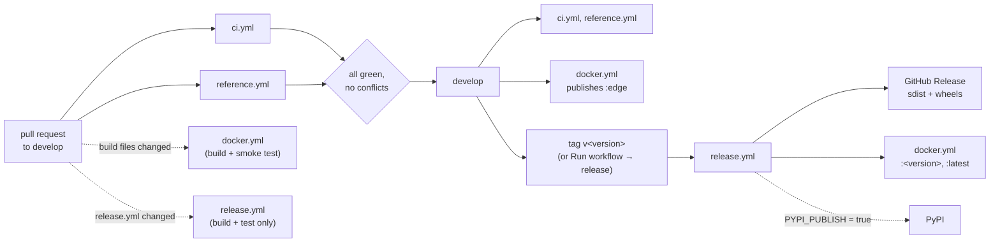
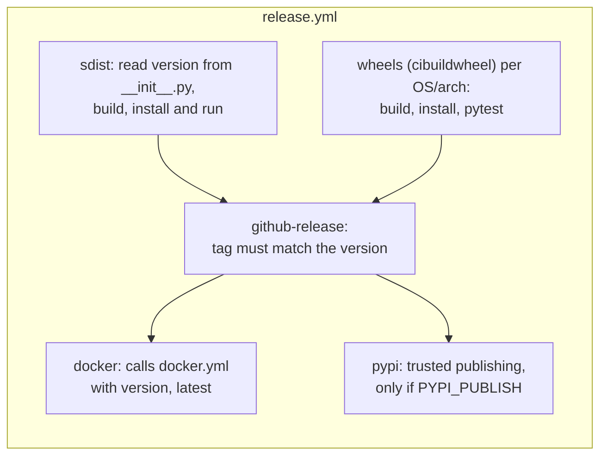
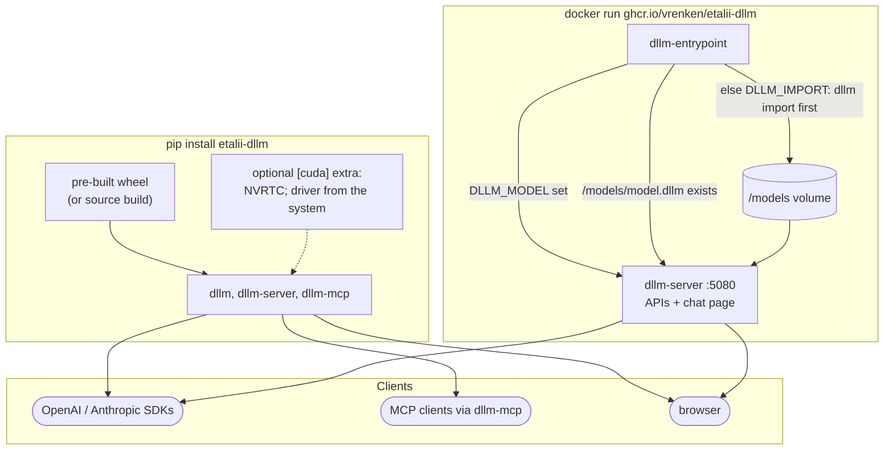

# Build, CI, releases and deployment

How a change becomes a tested wheel, a Docker image and a GitHub release, and what each GitHub Actions workflow
proves along the way. Step-by-step release instructions are in [releasing](../releasing.md); the project board in
[project board](../project-board.md).

## From commit to release

## What each workflow checks

| Workflow | Runs on | Proves |
| --- | --- | --- |
| `ci.yml` | every PR, pushes to `develop`/`main` | `ruff check` and `ruff format --check`; the full test suite, golden hashes included, on Linux (Python 3.11, 3.12, 3.13), Windows and macOS; the `[cuda]` extra installs and NVRTC compiles the GPU kernels for every architecture (no GPU needed) |
| `reference.yml` | every PR, pushes | the real pinned SmolLM2-135M, Qwen2.5-0.5B, Qwen2.5-1.5B and Qwen3-0.6B imports match `transformers` (tokens, templates, logits, greedy answers) and their golden hashes; LoRA adapters round-trip with `peft`; measures Qwen2.5-1.5B memory and speed |
| `docker.yml` | pushes to `develop`, PRs touching the build, releases | the image builds, answers identical requests identically and serves the chat page; publishes `ghcr.io/vrenken/etalii-dllm` for amd64 and arm64 |
| `release.yml` | tags `v*`, manual runs, PRs touching it | sdist and wheels for Linux x86_64/aarch64, Windows x86_64, macOS arm64/x86_64 and CPython 3.11 to 3.13, each running the whole test suite; then the release, the image and optionally PyPI |
| `project-sync.yml` | issue and milestone changes, daily, manual | creates missing milestones from `.github/milestones.json` and syncs issues to the GitHub Project board |

Because the golden hashes run in every one of these environments, a wheel that computes different bits from the
source tree cannot be released: the release job only runs after every wheel passed the suite.

## Build

`pip install .` runs scikit-build-core, which drives CMake to compile the header-only C++ kernels into one nanobind
extension (`etalii_dllm._kernels`) with the determinism flags (no fast-math, no FMA contraction). The CUDA kernel
source is embedded in that extension and compiled at run time, so the same wheel serves CPU-only and GPU machines;
the `[cuda]` extra only adds the NVRTC wheel. See [kernels and compute backends](kernels.md#build).

## Deployment options

- **Python package.** Wheels from the GitHub Release (and PyPI once enabled) give the `dllm`, `dllm-server` and
  `dllm-mcp` commands. The SIMD path is picked at start-up, so one wheel serves every CPU of its platform.
- **Docker image.** Two stages: the full Python image compiles the wheel, a slim image installs it with the
  `[cuda]` extra and runs as an unprivileged user. The entrypoint serves `DLLM_MODEL` if set, otherwise
  `/models/model.dllm`, importing `DLLM_IMPORT` into the volume first when the file is missing; with neither it
  serves the placeholder model. With the NVIDIA container toolkit, `--gpus all -e DLLM_DEVICE=cuda` runs on the
  GPU with the same output.

## Versions

The version lives only in `src/etalii_dllm/__init__.py`. A release tag must match it, and wheels, the image and
the GitHub Release all carry it, so a response's `system_fingerprint` plus the engine version identify exactly what
produced it.
