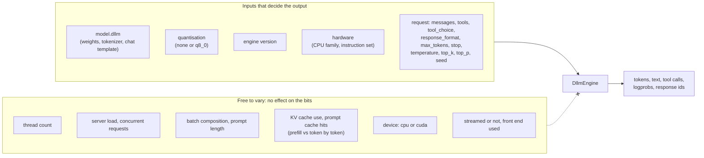
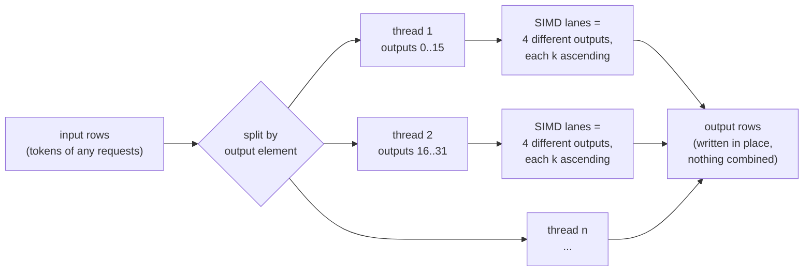
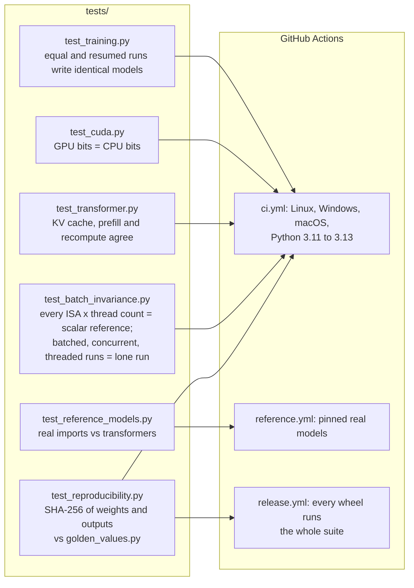

# Determinism by design

EtAlii.Dllm promises one thing above everything else: the same inputs on the same hardware give the same output
bits, every run, whatever else the machine is doing. This page shows what "the same inputs" means, where a normal
LLM stack loses determinism, and which part of this code base removes each cause. The research behind it is in
[deterministic inference](../research/deterministic-inference.md); the exact kernel orders are in
[kernels](../kernels.md).

## The contract

- **Same inputs, same output.** Every value in the left box is part of the input. Change a single character of a
  message, a tool result or the system prompt, and the output may change from that point on.
- **`system_fingerprint`** (`fp_` plus the start of the weights' SHA-256, hashed together with the quantisation
  when there is one) names the model part of the input. Equal fingerprints and equal requests give equal responses.
- **The seed defaults to 0.** A request without a seed is as reproducible as one with a seed; temperature 0 is
  greedy decoding and does not use the seed at all.
- **One counter depends on history.** With the prompt cache on (the default), the usage fields `cached_tokens` /
  `cache_read_input_tokens` report how much of the prompt an earlier request had already computed. The generated
  tokens never depend on it; `--prompt-cache 0` makes whole responses byte-identical regardless of history.
- **Hardware.** Identical output on *different* hardware is not promised, so kernels may use the fastest code path
  a machine offers as long as that path is fixed for the machine. Today the Linux, Windows and macOS CI runners
  happen to agree bit for bit, and the GPU reproduces the CPU.

## Where determinism is lost, and where it is restored

A mainstream stack loses reproducibility in many small places. Each one has a single owner here.

```mermaid
flowchart TB
    subgraph src["Sources of nondeterminism"]
        direction TB
        s1["Float addition is not associative:<br/>any change of summation order changes bits"]
        s2["Threads, split-K, atomics,<br/>tree reductions"]
        s3["Kernels that change strategy<br/>with batch size or sequence length"]
        s4["SIMD width, BLAS blocking,<br/>autotuning"]
        s5["Compiler FMA contraction,<br/>fast-math, flush-to-zero"]
        s6["Platform exp, log, sin, tanh"]
        s7["Library random generators,<br/>ambient entropy, clocks"]
        s8["Unstable sorts and ties<br/>in top-k / top-p"]
        s9["Hash order, locale,<br/>Unicode handling in text code"]
        s10["Ids and timestamps<br/>in API responses"]
        s11["GPU scheduling, warp reductions,<br/>tensor cores"]
    end

    subgraph fix["Owner in EtAlii.Dllm"]
        direction TB
        f1["nn.hpp, math.hpp: one accumulation per output,<br/>ascending index, double accumulator"]
        f2["parallel.hpp: threads split outputs,<br/>never a sum"]
        f3["nn.hpp: one strategy for every shape<br/>(batch invariance)"]
        f4["simd.hpp: lanes hold different outputs;<br/>path fixed once per machine; no BLAS"]
        f5["CMakeLists.txt: no fast-math,<br/>-ffp-contract=off; fpenv.hpp:<br/>IEEE default FP state per call"]
        f6["math.hpp: exp, log, sin, cos, tanh, erf<br/>from + - * / and sqrt"]
        f7["random.hpp: xoshiro256** seeded by SplitMix64<br/>(DeterministicRandom)"]
        f8["sampling.py: total order<br/>(probability desc, token id asc)"]
        f9["bpe.py, chat_template.py: ordinal,<br/>order-independent text handling;<br/>unicode.py: pinned Unicode 15.1"]
        f10["engine.py derive_id: ids hashed<br/>from fingerprint + request"]
        f11["cuda.hpp, kernels.cu: CPU order per thread,<br/>--fmad=false, no atomics"]
    end

    s1 --> f1
    s2 --> f2
    s3 --> f3
    s4 --> f4
    s5 --> f5
    s6 --> f6
    s7 --> f7
    s8 --> f8
    s9 --> f9
    s10 --> f10
    s11 --> f11
```

### Arithmetic

Every reduction (dot product, matmul, RMSNorm, softmax, attention, gradients) is a C++ kernel. Each output element
has its own accumulation: `double` accumulator, reduced index ascending, one rounding to `float` at the end.
Python and NumPy only orchestrate and do elementwise work, which is correctly rounded per element and so has no
order to get wrong. The compiler flags forbid reassociation and multiply-add contraction; where the code uses an
explicit `fma`, it multiplies two floats whose product is exact in double, so it rounds exactly like the separate
multiply and add.

### Parallelism and batching

Speed comes from doing *different* outputs at the same time, never from splitting one sum:

Because nothing is ever combined across threads, lanes or rows, the thread count, the instruction set, the tile
sizes and the other rows in a batch cannot reach a single bit. The same argument makes the KV cache a pure
optimisation: prefilling a prompt at once, feeding it token by token, or recomputing from scratch all give
identical logits. Integer sums (Q8_0 block dot products) are exact, so their order is free.

### Randomness and sampling

The only random numbers come from `DeterministicRandom` (xoshiro256\*\* seeded by SplitMix64), created per request
from its seed. Sampling sorts candidates by probability descending and token id ascending, a total order, then
walks cumulative sums in `double` in that order, so ties and float rounding cannot pick a different token on
another run. Nothing in model or engine code reads the clock, `random`, `numpy.random`, `uuid4` or the operating
system's entropy.

### Text and protocol

The tokenizer and chat template never depend on set iteration order, `PYTHONHASHSEED` or locale. Response and tool
call ids are hashed from the system fingerprint and the request, and responses carry no timestamps, so two equal
requests get byte-identical responses. All front ends build their answer from the same event stream
(`DllmEngine.chat_stream`), so the CLI, the OpenAI and Anthropic APIs and MCP agree, streamed or not.

### GPU

The CUDA kernels run the CPU kernels' exact order, one GPU thread per output element, compiled at run time with
`--fmad=false`, IEEE division and square root, no flush-to-zero, and `math.hpp` itself for the transcendentals.
There are no atomics, warp-shuffle reductions or tensor cores. The GPU therefore gives the CPU's bits and needs no
fingerprint of its own.

## What changes the output on purpose

| Change | Effect | Visible in |
| --- | --- | --- |
| Another model, or an edited `model.dllm` | New weights | `system_fingerprint` |
| `--quantize q8_0` | Different (quantised) arithmetic | A different `system_fingerprint` |
| A new engine version with new kernel or sampler semantics | New bits, documented in the commit | Golden hashes in `tests/golden_values.py` |
| Any request field, including one character of context | A different computation | The request itself |

## How it is verified

A golden hash that changes without an intended semantic change is treated as a determinism bug to find, never as
a constant to update. If a future hardware-specific kernel makes platforms disagree, the golden values get keyed
per platform instead of forcing the kernels to be portable.

## What this means for users

- Asking the same question twice, through any front end, gives the same answer, including the same code, the same
  tool calls and the same response ids.
- A bug report is reproducible: the request plus the `system_fingerprint` and the machine is enough to get the exact
  same output again.
- Determinism is not robustness. The model is as sensitive to its input as any LLM: a different file in the
  context, a timestamp in a tool result or a reworded question can change everything after it. And a wrong answer
  is wrong every time.
