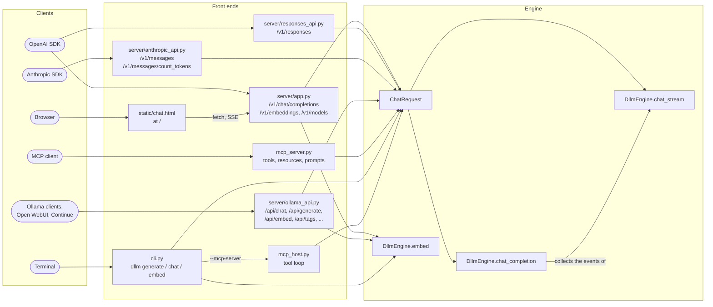
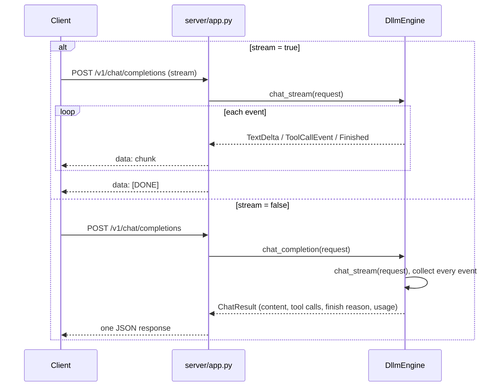
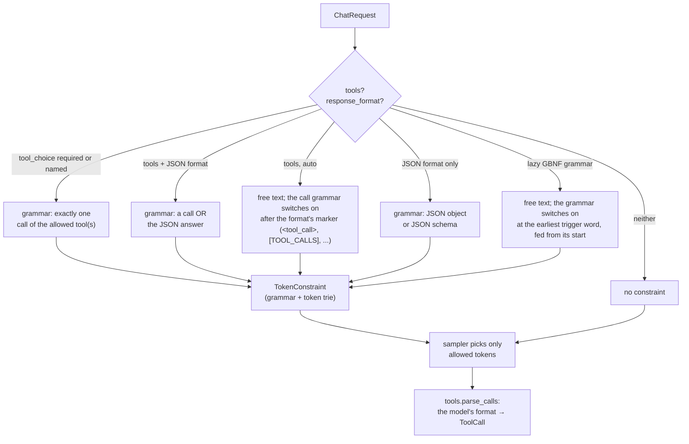
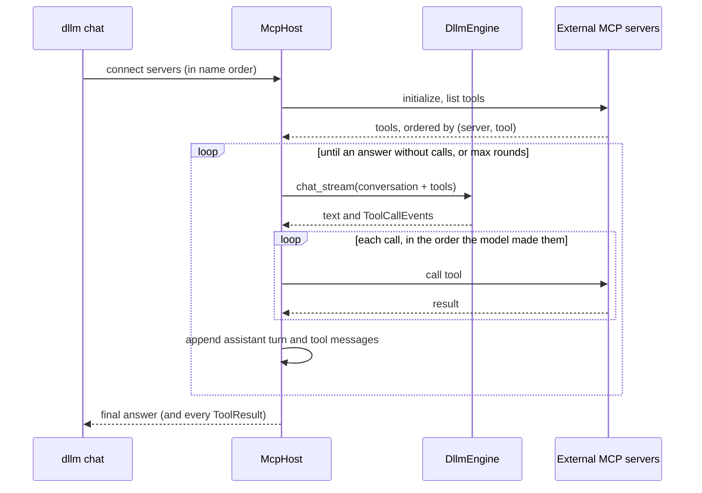

# Front ends, APIs and MCP

EtAlii.Dllm speaks the protocols existing tools already use: the OpenAI (Chat Completions and Responses), Anthropic
and Ollama HTTP APIs, a browser
chat page, the Model Context Protocol in both directions, and a command line. All of them are thin adapters over one
method, `DllmEngine.chat_stream`, so the same question gets the same answer through every door. The wire formats
are documented in [HTTP API](../api.md) and [MCP](../mcp.md); the path inside the engine in
[inference pipeline](inference.md).

## One engine, many doors

Each front end does three things only: translate its wire request into a `ChatRequest` (messages, tools,
`tool_choice`, `response_format`, sampling options, stop strings, logprobs), call the engine, and translate the
engine's events back into its wire format. Validation errors raised by the engine (unknown tools, unsupported
schemas) become the protocol's own error response before any token is generated. Anything two front ends would
both need belongs in the engine.

| Front end | Entry | Streaming | Notes |
| --- | --- | --- | --- |
| OpenAI API | `dllm-server` | SSE chunks, optional usage chunk | tools, `json_object`/`json_schema`, logprobs, embeddings |
| OpenAI Responses API | `dllm-server` | typed `response.*` SSE events | function tools, structured output; `previous_response_id` continues a stored conversation |
| Anthropic API | `dllm-server` | SSE message events | tools, structured output, `count_tokens` |
| Ollama API | `dllm-server` | newline-delimited JSON (default on) | chat, generate, embeddings, tags; durations and timestamps are 0 |
| Web chat | `dllm-server`, `/` | over the OpenAI stream | a static page, no logic of its own |
| MCP server | `dllm-mcp` (stdio) | no | tools `generate`, `chat`, `model_info`; model card, chat template and determinism resources; prompts |
| CLI | `dllm generate`, `dllm chat`, `dllm embed` | to the terminal | prints the fingerprint to stderr |
| MCP host | `dllm chat --mcp-server ...` | to the terminal | the model calls external MCP tools |

## Streamed and non-streamed answers are the same answer

`chat_completion` is not a second code path: it runs `chat_stream` and concatenates its events. The text of the
streamed chunks, joined, is therefore exactly the content of the non-streamed response, and the tool calls,
finish reason and token counts are identical.

## Ids without clocks

Mainstream APIs put random ids and timestamps in every response. Here the response id is
`derive_id(prefix, request)`: a SHA-256 of the system fingerprint and the canonical JSON of the request (without the
`stream` flags), so equal requests get equal ids whether streamed or not. Tool call ids are hashed from the request
id, the output fingerprint and the call's index. `created` is always 0 (Ollama's `created_at` is the Unix epoch and its durations are 0). A response is therefore a pure function of
the model and the request, byte for byte.

### Receipts

Because a response is a pure function of the weights and the request, the engine can describe it completely: on
`Finished`, `_events` builds a [receipt](../receipts.md) (`receipts.make_receipt`) from the engine request, the
system fingerprint and hashes of the tokens, text and tool calls. Every front end only decides whether to show it
(`"receipt": true`), and leaves it out of `derive_id`, so asking for one changes no id. `receipts.verify` replays
the recorded request through `chat_completion` and compares the hashes; `dllm replay`, `POST /v1/receipts/verify`
and the MCP `verify_receipt` tool are thin wrappers around it. A front end that knows the previous turn's receipt
passes it as `ChatRequest.previous_receipt` (the Responses API takes it from the stored response), the engine records
it as `previous`, and `receipts.verify_chain` checks a whole conversation: every turn, the links, and that each
turn's messages continue the previous answer exactly ([receipt chains](../agents.md#receipt-chains)).

### Conversations without server state

The Responses API can continue a conversation by `previous_response_id`. The server keeps the most recent responses
in memory together with the conversation each one ended; a follow-up request is expanded to the full conversation
and goes through `chat_stream` like any other. Because response ids are hashes of the request (which includes the
previous id) and the weights, replaying a conversation from the start reproduces the same ids and the same answers.

## Tool calling and structured output

Tools and JSON output are not post-processing; they constrain which tokens the sampler may pick.

Tools are presented to the model through its chat template when the template supports them (Qwen2.5 does), and
otherwise as Hermes-style instructions in the system message. `tools.detect_format` reads the call format from the
template (`DllmEngine.tool_format`): Hermes `<tool_call>{"name": ..., "arguments": ...}</tool_call>`, Llama 3's bare
`{"name": ..., "parameters": ...}`, Mistral's `[TOOL_CALLS][...]`, Granite's `<|tool_call|>[...]`, Qwen3-Coder's
XML parameters, DeepSeek's (V3/R1 or V3.1) marker-delimited calls, a Python call list, Phi-4-mini's `functools[...]`
(its tools ride on the system message) or Command R7B's action block; the engine keeps that format's special
marker tokens visible in the decoded text. The grammar guarantees that a call names an offered
tool and that its arguments are valid under the tool's JSON schema (leniently, or in full for `strict` tools).
`ToolChoice` also carries the allowed tools (`ToolChoice.callable` narrows the grammar and the parser, never the
prompt) and the one-call limit: listed formats get a one-call list, and for marker formats `TokenConstraint(...,
once=True)` ends the answer at the first call's closing marker instead of re-arming the trigger. While tools are
offered, the stream only releases text that is certainly part of the answer, never the beginning of a call.

A GBNF grammar compiles to the same automaton (`gbnf.py`): left-recursive rules are first rewritten into right
recursion that derives the same strings, and token references (`<[id]>`, `<think>`, `!<...>`) become items that read
one whole token, resolved against the engine's `TokenTable`. `TokenTrie.allowed` adds the tokens such an item reads
to those whose bytes fit, and `Matcher.advance_token` follows both ways after a token. A lazy grammar
(`ResponseFormat.triggers`) is a `TokenConstraint` with `lazy` trigger words: unlike the tool-call trigger, the
grammar is fed from the start of the trigger word and stays on to the end of the answer.

### Reasoning

For a thinking model (its template writes `<think>` blocks) `DllmEngine._events` splits the output by the fixed rule
in `reasoning.py`: `ReasoningDelta` events carry the block's text and `TextDelta` events the answer, and only text
that every continuation keeps is released (`reasoning.streamable`), so streamed and non-streamed answers match. Each
front end maps `ReasoningDelta` to its own field. `reasoning.Tracker` follows the block token by token inside the
generator, which closes it with fixed tokens when `max_reasoning_tokens` is spent; tool calls are parsed from the
answer part only.

## The MCP host loop

The model side of this loop is as reproducible as any chat: the prompt lists tools in a fixed order, calls run
one at a time in the model's order, and ids come from the conversation. External tools are outside the guarantee:
a clock or a search engine may answer differently next time, and everything after it can then differ. So
`transcripts.Recorder` records every round (its receipt, text, calls and tool results) as an
[agent transcript](../agents.md#transcripts), and `transcripts.replay` runs the same loop with
`RecordedTools`, which stands in for `McpHost` and answers each call from the transcript, then compares the rounds'
receipts. `builtin_tools.server` is an in-process MCP server (`dllm chat --tool`, or `dllm-tools` over stdio) whose
tools (exact calculator, read-only files, document search) answer the same on every run.

## Concurrency

`dllm-server` handles requests concurrently. Each request owns its sampler (seeded from the request), its
constraint and, for as long as it runs, its KV cache (fresh, or lent by the prompt cache); the model weights are
shared and read-only. Requests that decode at the same time are batched into one forward pass per step, and each
still gets the bits of a lone run (see [continuous batching](inference.md#continuous-batching)). Load changes how
long a request takes, never what it returns; `tests/test_batch_invariance.py` runs concurrent server requests
against a lone one.
