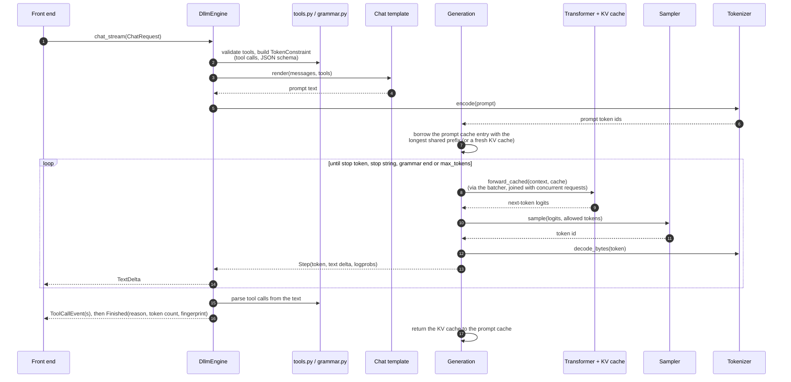
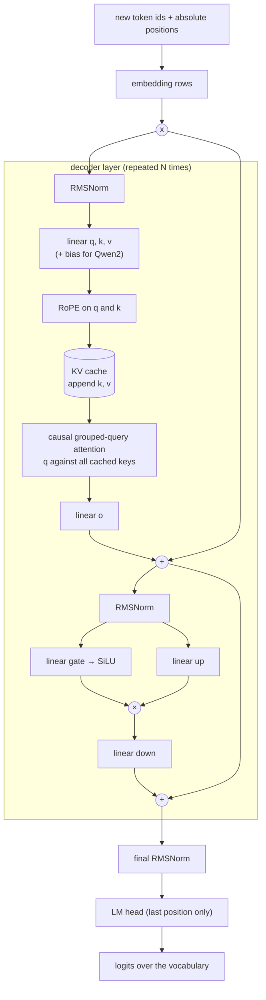
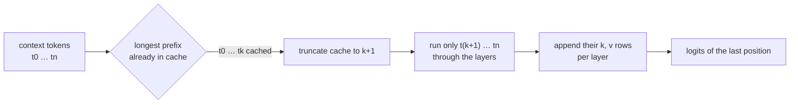
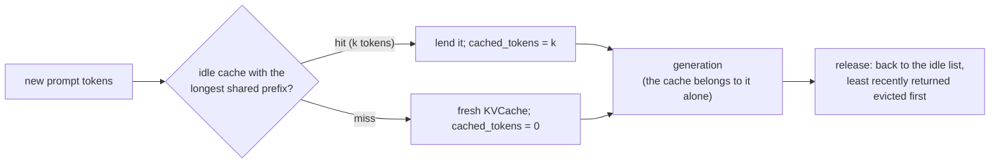
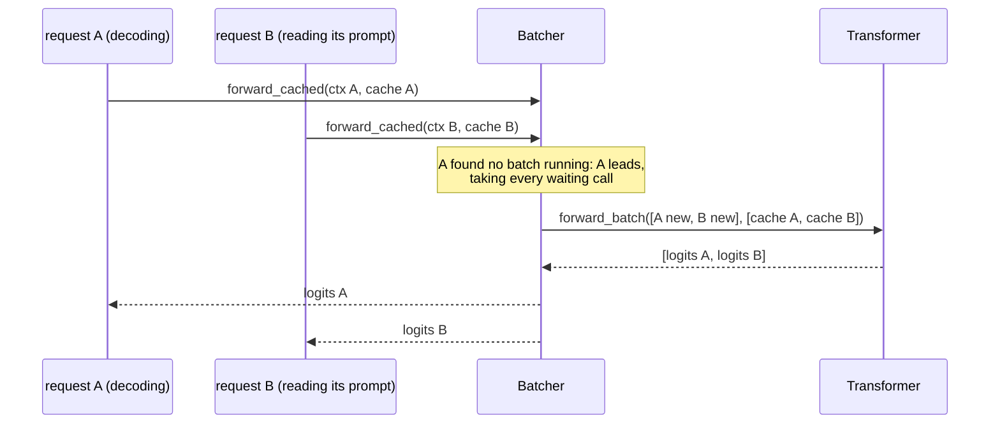
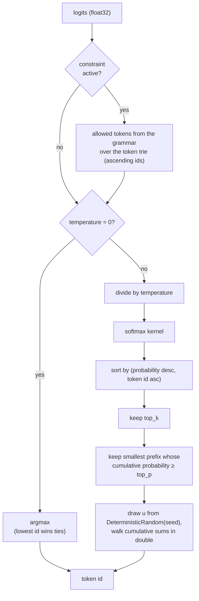

# Inference pipeline

This page follows one chat request from the messages a client sends to the tokens it gets back. Every front end
(CLI, OpenAI and Anthropic APIs, web chat, MCP) enters at the same point, `DllmEngine.chat_stream`, so this is the
only inference path there is. How the front ends wrap it is in [front ends](README.md#module-map); the kernel
arithmetic is in [kernels](../kernels.md).

## End to end

1. **Validate and constrain.** Unknown tools or unsupported schemas fail before any token is generated. A
   `response_format` or forced `tool_choice` becomes a grammar; with optional tools, the grammar only switches on
   once the model writes `<tool_call>`.
2. **Render.** The model's own Jinja chat template, rendered the way `transformers.apply_chat_template` does. Tools
   go through the template when it supports them, otherwise into the system message as Hermes instructions. A final
   assistant message is a prefill: the answer continues its text. Models without a template (the placeholder) use
   the fixed format in `chat.py`.
3. **Tokenize.** Byte-level BPE from the model's `tokenizer.json` (`bpe.py`); added tokens such as
   `<|im_start|>` are split out before the byte-pair merges.
4. **Decode loop** (`generation.py`): forward pass, choose a token, append, repeat. Text is released only as whole
   UTF-8 characters, and text that could still become a stop string is held back until it is certain.
5. **Events.** `chat_stream` turns steps into `TextDelta`, `ToolCallEvent` and `Finished` events. When tools are
   offered, only text that is certainly answer text is streamed; the tool calls are parsed at the end and get ids
   hashed from the request and the result. `chat_completion` collects the same events, so a streamed answer and a
   non-streamed one are identical.

## The decoder

`transformer.py` implements the Llama/Qwen2 decoder family (SmolLM2, TinyLlama, Qwen2.5). Its shape comes from
`TransformerConfig`: layers, heads, key-value heads, head size, RoPE base, norm epsilon, whether q/k/v have biases
(Qwen2) and whether the output head is tied to the embeddings.

Every box with a sum inside (linear, RMSNorm, RoPE's angles, attention) is a C++ kernel with one fixed order;
the residual additions and the SwiGLU product are elementwise float32 operations, exactly as in the reference
implementations. With `--device cuda` the same steps run on `CudaTensor`s through `cuda.py`, weights and cache stay
on the GPU, and only the embedding rows go up and the logits come back. With `--quantize q8_0` the linear layers
use 8-bit weights with exact integer block sums.

## KV cache

`KVCache` stores keys and values per layer in `[positions, kv_heads, head_dim]` buffers that grow by doubling.
`forward_cached` reuses the longest prefix of the context that is already in the cache and runs only the rest. The
first call is the prefill (the whole prompt in one pass); later calls feed one new token. Because every kernel
computes each row on its own in one order, a row's keys and values do not depend on how many tokens were processed
with it, so the cache is purely an optimisation: prefill, token-by-token feeding and a full recompute give the same
logits (`tests/test_transformer.py`). `forward_batch` extends the same idea to several independent sequences: their
new tokens are stacked through every linear layer and attention runs per sequence against its own cache, and each
sequence still gets the bits of a lone run (`tests/test_batch_invariance.py`).

### Prompt cache across requests

A multi-turn chat, a shared system prompt or an MCP tool loop sends prompts that start with the tokens of an earlier
one. `PromptCache` (`prompt_cache.py`) keeps the KV caches of the last few generations (4 by default,
`--prompt-cache` / `DLLM_PROMPT_CACHE`, 0 disables it) and lends the next generation the one sharing the longest
prefix with its prompt; `forward_cached` then computes only the new tokens.

Because cached rows are exactly what a recompute would produce, a hit gives the same tokens as a cold run
(`tests/test_prompt_cache.py`). Each cache is lent to one generation at a time, so concurrent requests never share
one. The only visible difference is the usage counter (`cached_tokens` in OpenAI's `prompt_tokens_details`,
`cache_read_input_tokens` for Anthropic), which depends on what ran before; `--prompt-cache 0` makes responses
byte-identical regardless of history.

### Continuous batching

When several requests decode at the same time, `Batcher` (`batching.py`) gathers their `forward_cached` calls and
runs them as one `forward_batch`: the new tokens of every request (a prompt being read or one decoded token) go
through each linear layer as one stacked matrix, so the weights are read once per step instead of once per request.
There is no scheduler thread; the first caller that finds no batch running leads the next one.

Which requests share a step depends on timing, but the output cannot: every kernel computes each row on its own
and attention runs per sequence against its own cache, so each request gets the bits of a lone run
(`tests/test_batch_invariance.py`). This is the guarantee mainstream batching servers do not give.

## Choosing a token

- **Greedy** (temperature 0) takes the argmax; under a constraint it first checks whether the overall argmax is
  allowed, which avoids computing the whole mask on most steps.
- **Sampling** uses a `DeterministicRandom` created per request from its seed (0 when absent), so a request's draws
  never depend on other requests. The candidate order is total, and the cumulative sums run in `double` in that
  order.
- **Constraints** (`grammar.py`) track a byte-level JSON grammar; the tokens allowed next are found by walking the
  grammar through a trie of every token's bytes. Stop tokens are allowed exactly when the grammar may end.
- **Logprobs** come from a `log_softmax` kernel over the unconstrained logits; alternatives are ordered by value,
  then token id.

## Stopping

A generation ends at the first of: a stop token (the model's end-of-sequence ids), a stop string from the request
(which is cut from the text), the grammar reaching its end, or `max_tokens`. The finish reason (`stop`, `length`,
or `tool_calls` when calls were parsed) and the fingerprint of the generated token ids arrive in the
`Finished` event.
