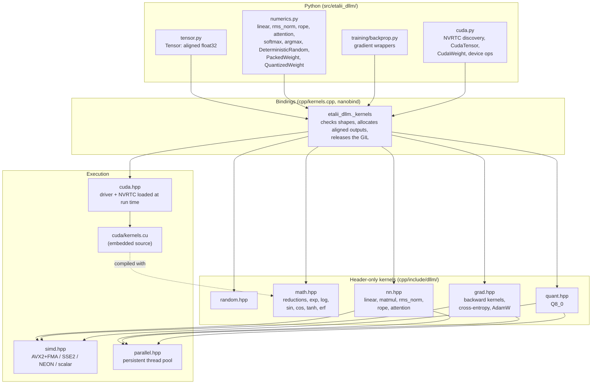
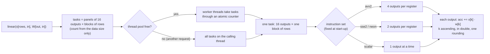
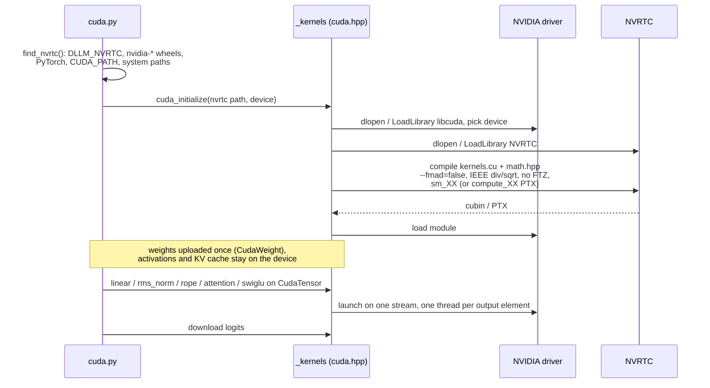
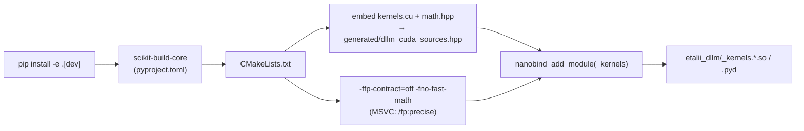

# Numeric kernels and compute backends

Every floating point reduction in EtAlii.Dllm runs in a small C++ library with one documented evaluation order per
kernel. This page shows how that library is organised: the Python wrappers, the bindings, the header-only kernels,
the dispatch to threads, SIMD and the GPU, and the build. The per-kernel formulas and orders are in
[kernels](../kernels.md); why they matter is in [determinism by design](determinism.md).

## Layers

- **Python decides what to compute, C++ computes it.** `numerics.py` is a thin layer: it converts inputs to
  `float32` `Tensor`s, calls `_kernels` and wraps results. Elementwise work (residual additions, the SwiGLU product,
  temperature scaling) may stay in NumPy because it has no order to get wrong; sums, dot products and norms may not.
- **The bindings stay thin.** `kernels.cpp` validates shapes, allocates 64-byte aligned outputs and releases the
  GIL around long kernels, so requests on several Python threads can run kernels at the same time.
- **Kernels are header-only**, in the `dllm` namespace, so the CPU and GPU builds share `math.hpp` verbatim.

## Splitting work without changing a bit

The kernels are fast because they compute many outputs at once, never because they split one sum.

- **`parallel.hpp`**: a process-wide pool (`DLLM_THREADS`, `--threads`, `numerics.set_threads`; default all cores).
  Each task owns a disjoint set of outputs and nothing is combined across tasks, so the thread count and scheduling
  are speed settings only. When the pool is busy with another caller's kernel, the tasks run on the calling thread,
  with the same result. After `fork()` a child starts its own workers.
- **`fpenv.hpp`**: every binding runs under `FpEnvGuard`, which sets round-to-nearest with subnormals kept for the
  call and restores the caller's state; pool workers enter that state when they start. A library that turned
  flush-to-zero on for the process therefore cannot change a kernel's bits.
- **`simd.hpp`**: the widest supported variant is chosen once per process. SIMD lanes hold *different* outputs,
  each advancing through `k` in the same order as the scalar loop. The product of two floats is exact in double, so
  an FMA rounds once exactly like a multiply plus an add, and every variant equals `linear_reference` bit for bit.
  `PackedWeight` rearranges a weight once at load time into the `[in][16]` panels the vector loop reads.
- **Tiling** (for example `matmul`'s 64-column, 256-deep tiles) only changes the order in which outputs are
  visited; each output keeps one accumulator across all tiles.
- **Q8_0** (`quant.hpp`) sums int8 products within a block in int32, which is exact and so order-free, then combines
  blocks in ascending order in double.

`tests/test_batch_invariance.py` forces every supported instruction set and several thread counts, and requires the
bits of the scalar reference, of a lone row, and of a lone request.

## GPU backend

- **Nothing CUDA at build time.** CMake embeds `cuda/kernels.cu` and `math.hpp` in the extension as byte arrays.
  At run time the driver and NVRTC are loaded dynamically, so one wheel works with or without a GPU and without a
  CUDA toolkit; without them `--device cuda` fails with a message naming what is missing.
- **The CPU's order on the GPU.** Each kernel in `kernels.cu` mirrors a CPU kernel with one GPU thread per output
  element and the same accumulation. No atomics, no warp-shuffle reductions, no tensor cores, no CUDA math library:
  transcendentals are `math.hpp` compiled for the device. The GPU therefore returns the CPU's bits
  (`tests/test_cuda.py`), and a model has the same `system_fingerprint` on both devices.
- **Device-resident decoding.** `transformer.py` keeps weights, activations and the KV cache on the GPU; only the
  embedding rows go up and the logits come back.

## Build

The compiler flags are part of the determinism contract: they stop the compiler from reassociating sums or fusing
multiplies and adds on its own. AVX2 variants are enabled per function through target attributes, not through
`-march=native`, so one binary runs on every x86-64 CPU and picks its path at start-up.

## Adding a kernel

1. Write it in `cpp/include/dllm/` with one accumulation per output, index ascending, `double` accumulator, and
   no branch on input size.
2. Bind it in `kernels.cpp` (shape checks, aligned output, GIL released) and wrap it in `numerics.py`.
3. If the decoder uses it on the GPU, add the mirror kernel to `cpp/cuda/kernels.cu` and a CPU-vs-GPU test.
4. Document its order in [kernels](../kernels.md) and test it against a plain reference loop (and, for new
   transcendentals, for accuracy).
