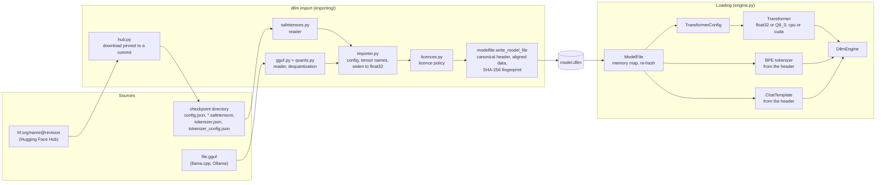
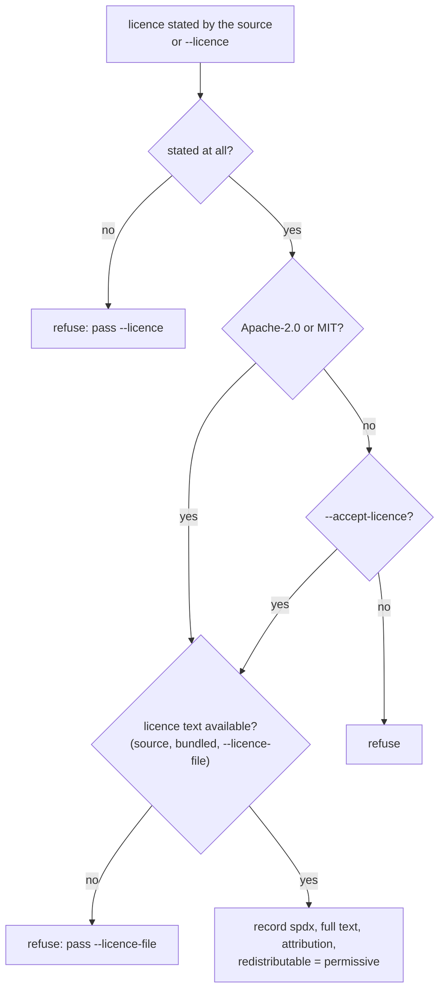
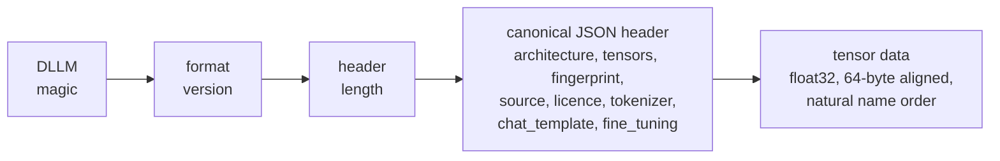
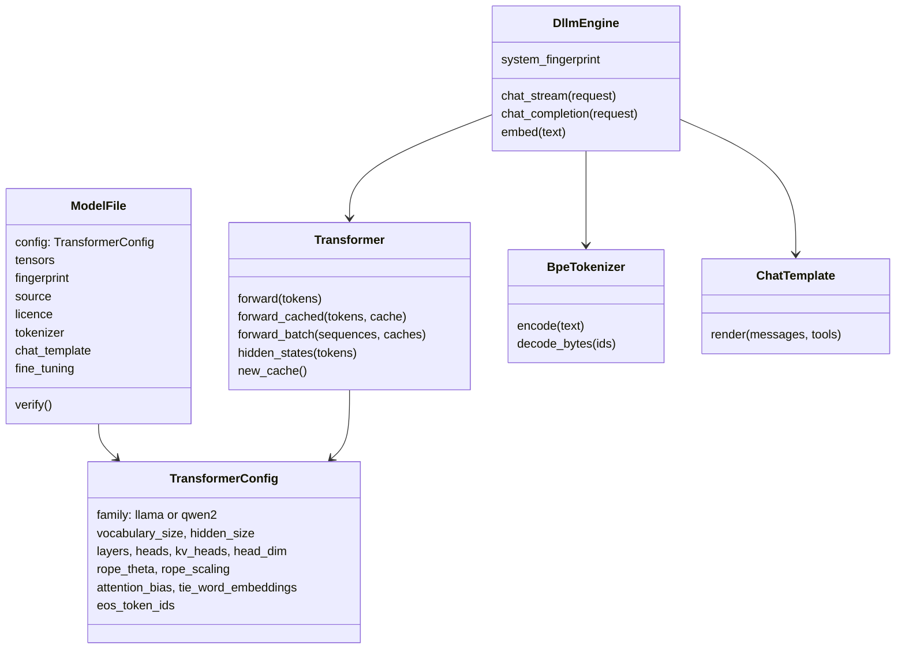

# Model import and the model.dllm format

EtAlii.Dllm does not train models from scratch. It imports small open-weight models once, from Hugging Face
safetensors checkpoints or GGUF files, into a single `model.dllm` file, and runs that file from then on. This page
shows the path from a source checkpoint to a running decoder. The byte layout and the conversion rules are
specified in [model format](../model-format.md); the model choice and licence policy in
[model import](../research/model-import.md).

## From source to running model

## Import

`import_model` accepts three kinds of source and turns each into the same intermediate form: a
`TransformerConfig`, a list of named float32 tensors, the tokenizer files, the chat template and the licence it
found.

- **`hf:org/name[@revision]`** is downloaded into a cache with the revision resolved to a commit hash, so the file
  records exactly what was read. Then it is imported as a directory.
- **A checkpoint directory** is read through `safetensors.py`. `config.json` (and `generation_config.json` for the
  stop tokens) becomes the `TransformerConfig`; Hugging Face tensor names are mapped to ours
  (`model.layers.3.self_attn.q_proj.weight` → `layers.3.attention.q.weight`). BF16 and F16 widen to float32 exactly.
- **A GGUF file** is read through `gguf.py`. Its metadata becomes the configuration and the tokenizer; quantised
  blocks (`Q4_0` to `Q8_0`, K-quants) are dequantised in llama.cpp's order, bit-identical to `gguf-py`, and the
  rotary permutation llama.cpp applies to q and k is undone.

The importer fails loudly on anything the decoder cannot run exactly (other architectures, non-SiLU activations,
MLP biases, sliding windows, partial rotary, unsupported RoPE scaling) rather than producing a model that behaves
differently from the original.

### Licences

The licence text and an attribution line travel inside the model file, so a `model.dllm` can be passed on with its
terms attached.

## The container

Two properties matter for the rest of the system:

- **The fingerprint is the model's identity.** The SHA-256 of the data section is written into the header and
  becomes the engine's `system_fingerprint` (`fp_` plus its first 12 hex digits). `ModelFile` re-hashes the data on
  open, so a corrupted or edited file cannot pass for the original.
- **Imports are reproducible.** The header is canonical JSON with sorted keys, tensors are in natural name order,
  and nothing comes from a clock or the environment, so importing the same source twice gives byte-identical files.

## Loading

`DllmEngine.from_model_file` memory-maps the file (`ModelFile`), so the tensors are kernel-ready aligned arrays
without a copy. From the header it builds the `TransformerConfig`, the BPE tokenizer (`bpe.py`, from the stored
`tokenizer.json`) and the `ChatTemplate` (with the special tokens from `tokenizer_config.json`), and collects the
stop tokens (the configuration's end-of-sequence ids plus the tokenizer's). The `Transformer` then prepares its
weights once: packed into the 16-output panels the SIMD kernels read, quantised to Q8_0 with `--quantize q8_0`
(which changes the fingerprint), or uploaded to the GPU with `--device cuda` (which does not).

## Verification against the originals

An imported model is only useful if it is the same model. `tests/test_reference_models.py` checks this against
Hugging Face `transformers` and `tokenizers`: tiny synthetic Llama and Qwen2 checkpoints in every run, and the
pinned real SmolLM2-135M, Qwen2.5-0.5B and Qwen2.5-1.5B instruct models in the `Reference models` workflow. Token
ids and rendered chat templates must match exactly; logits agree to about 1e-5 (bit equality is not expected,
since `transformers` sums in a different order), greedy answers are identical, and our own outputs are pinned
exactly in `tests/golden_values.py`.
