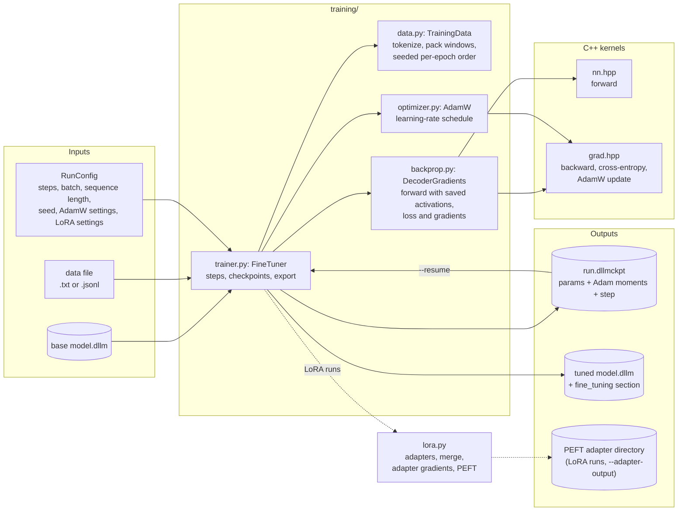
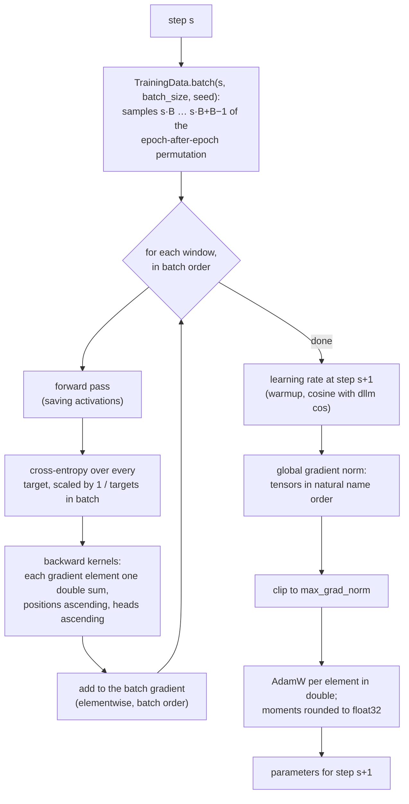
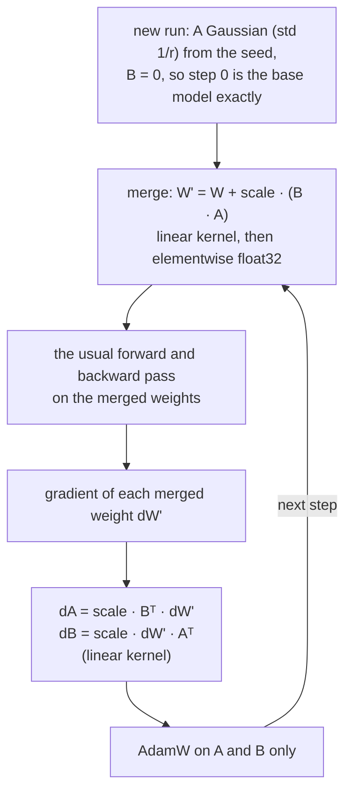
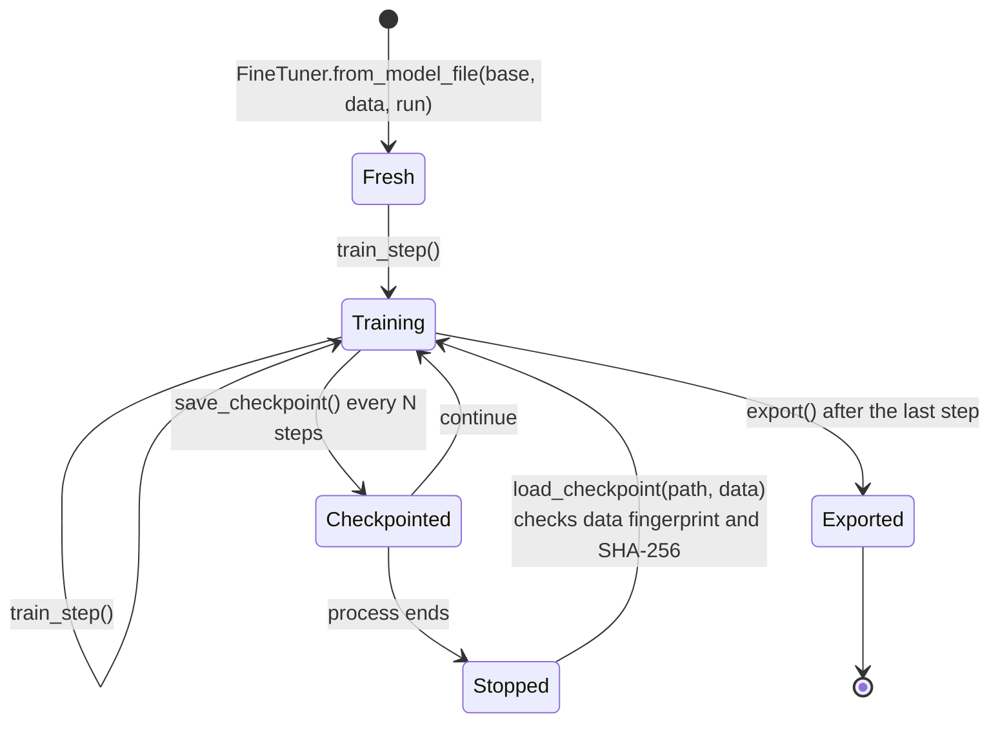

# Deterministic fine-tuning

`dllm finetune` continues training an imported model on your own text. It trains either every parameter or
low-rank [LoRA adapters](#lora-adapters) on the linear layers. Either way a run is reproducible in the strongest
sense: the same base model, data and settings write a byte-identical fine-tuned `model.dllm`, and a run stopped at
a checkpoint and resumed ends in the same bytes as one that ran straight through. This page shows how the
`training/` package is put together. Options, data formats and file layouts are in [training](../training.md);
the gradient kernel orders in [kernels](../kernels.md#gradients-gradhpp).

## Components

The trainer reuses the inference decoder's forward pass (its last-position logits equal `Transformer.forward` bit
for bit) and adds reverse-mode gradients built from `grad.hpp`. The only randomness is the data order and, in a
LoRA run, the adapters' starting values, both drawn from `DeterministicRandom` with the run seed. There is no dropout,
and the weights themselves always come from an imported model.

## One training step

- **Data order from the step number alone.** Windows are visited in a permutation drawn from `DeterministicRandom`
  seeded by the run seed and the epoch. Which samples step `s` reads follows from `s`, so a resumed run needs no
  data-loader state.
- **Batch invariance.** Each window's loss and gradients are computed on their own and added in batch order, so a
  window's contribution does not depend on which windows share its batch.
- **Order everywhere.** Gradient elements accumulate in double in a fixed order; the gradient norm and the updates
  visit tensors in natural name order; bias corrections use repeated multiplication instead of `pow`, and the
  schedule uses the portable `dllm` cosine.

## LoRA adapters

With `--lora-rank r`, the base weights stay frozen and each adapted linear layer `W` (`[out, in]`) gets two trained
matrices, `A` (`[r, in]`) and `B` (`[out, r]`). The trained parameters and the AdamW moments are those adapters
alone. That makes checkpoints and adapter files small, but it does not make a step cheaper.

- **One way to apply an adapter.** Training, `-o` (the merged model file), `--adapter` at load time and
  `dllm import ADAPTER --base` all compute the same merge in `lora.py`. The model that was trained is therefore
  bit for bit the model that is served, and every route gives the same `system_fingerprint`. An adapter is never
  evaluated as a separate low-rank pass that would round differently.
- **The price.** Because the decoder runs on the merged weights, a LoRA step costs about as much compute as a full
  fine-tuning step: the full backward pass still runs. What it saves is optimizer memory.
- **Interoperable.** `--adapter-output` writes a Hugging Face PEFT directory (`adapter_config.json`,
  `adapter_model.safetensors`) that PEFT loads as it is. PEFT adapters import the same way, as described in
  [model import](models.md#lora-adapters).

## Checkpoints and resume

A checkpoint stores the parameters, both Adam moments and the step, plus the run settings, loss history, base model
metadata and the data fingerprint. In a LoRA run the parameters are only the adapters, so resuming also needs the
base model again, and the checkpoint refuses a base whose fingerprint differs from the one the run started from. Because the moments are rounded to float32 *before* the next step uses them, the
state written to disk is exactly the state the next step reads, so resuming continues on the same bits. Loading
re-hashes the tensor data and refuses data whose fingerprint differs from the run's.

## Output

The exported model is an ordinary `model.dllm` with the base model's tokenizer, chat template, source and licence
(its attribution now says the weights were modified), plus a `fine_tuning` section recording the base model
fingerprint, the data fingerprint, all run settings, the steps completed and the final loss. New weights mean a new
`system_fingerprint`; everything described in [inference pipeline](inference.md) then applies unchanged. A LoRA
run exports the base weights with its adapters merged in, and can also write the adapters alone as a PEFT directory.
The file's `lineage` gains a `fine_tune` step from the base model's fingerprint. `--receipt` writes a
[training receipt](../provenance.md#training-receipts) (a [distillation](../model-building.md#distilling) also records its teacher): the base and data fingerprints, the run settings, every
step's loss and the resulting weights' fingerprint. `training.receipt.verify` (`dllm replay`) trains again with the
same `load_data` and compares the losses step by step.

`tests/test_training.py` checks the gradient kernels against float64 references, the decoder's gradients against
finite differences, byte-identical runs, bit-exact resumption, and golden hashes of the gradients and of a short
fine-tuning run. `tests/test_lora.py` does the same for adapters. It checks their gradients against finite
differences, checks that LoRA runs and resumed runs are byte-identical, and checks that merged files and load-time
adapters give the same bits.
